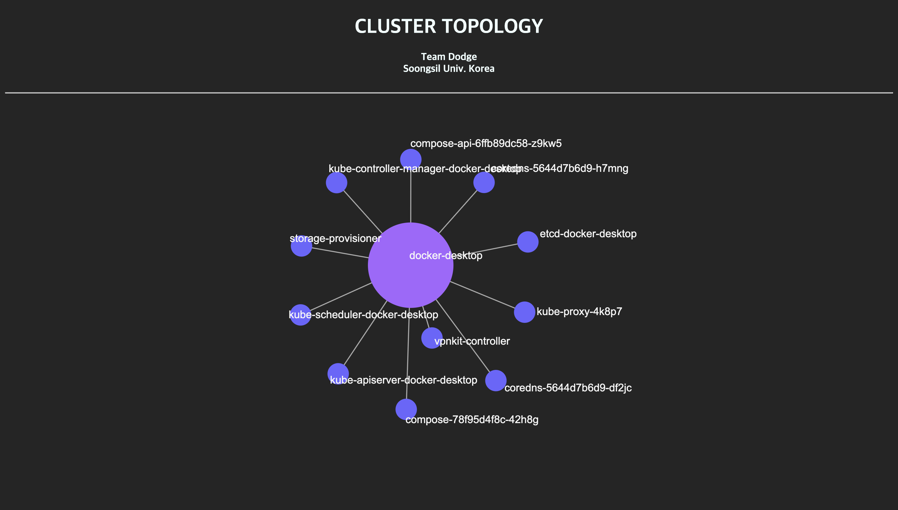

# Kubernetes Dashboard with D3.js

## info

This k8s dashboard provide pod live migration monitoring. You can use this dashbord as general k8s topology graph dashboard.





## Dependencies

- ENV

  - Kubernetes Master node labeling - **This setting must be done**

    ```bash
    $ kubectl label nodes <master-node-name> nodetype=master
    ```

    

- Dashboard

  - node.js

- Migration agent
  - python
  - CRIU
  - Docker
  - ampq


## Start

1. Start npm

   ```bash
   $ npm start
   ```

2. Connect to dashboard

   ```bash
   $ http://[ip address]:8000/dashboard
   ```


## Cuation

This repository doesn't include live migration agent 